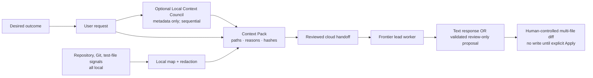

# Cenro

<p align="center">
  
</p>

<p align="center"><strong>Your project, understood before AI writes code.</strong></p>

<p align="center">
  A Windows-first coding workspace that understands a repository locally, shapes a focused Context Pack, and lets a chosen AI provider produce reviewable code changes.
</p>

## What Cenro is

Cenro is not a tiny local model pretending to replace a strong coding model.
It is the local intelligence layer around one: it maps a repository on-device,
improves the user’s intent into a focused Context Pack, shows exactly what a
provider receives, and keeps the next review step visible.

> Give your chosen AI provider the repository awareness of a senior developer,
> while keeping the data boundary, authority, and review loop visible to the
> person who owns the code.

The product goal is a better verified result per dollar—not fake “token savings.”
Cenro builds **bounded repository awareness** locally and sends the smallest
useful Context Pack. A provider call is explicitly approved; if more evidence is
needed, Cenro asks rather than silently uploading another source slice.

Before the receipt, Cenro can run a small **Local Context Council** in sequence:
an intent analyst, then a context critic. It sees only the user request and
sanitized repository metadata—never raw source, diffs, hashes, or secrets. A
completed/degraded Council with local calls can sharpen the cloud brief; an
unavailable or cancelled Council falls back to deterministic receipt-only
guidance and adds no cloud prompt tokens.

## The Context Pack workflow



The current MVP includes:

- A bounded local repository scan with language inventory, entry-point and test
  inference, Git signals, symbol extraction, relevance ranking, and source
  provenance.
- An optional, metadata-only Local Context Council. Its intent analyst and
  context critic run one local request at a time. Only a usable local result
  contributes a compact, fallible planning brief; receipt-only fallbacks never
  see workspace source code or add cloud prompt tokens.
- Secret protection before packaging: secret-looking paths (including `.env*`,
  `.envrc`, key/certificate files, credential folders), symlinks, binary files,
  and files outside the chosen workspace are excluded. Known inline credential
  forms are redacted in selected source text.
- A Context Pack kept only in the main process for a short time. Its cloud
  receipt is bound to the user request, provider, model, selected evidence, and
  expiry; it is owner-bound and single-use.
- A cloud handoff modal that names the provider/model, selected paths,
  character/token estimates, redaction counts, and maximum-cost preflight.
  Cenro cannot contact the provider until the user explicitly approves that
  exact boundary.
- Provider-reported usage parsing and a local cost ledger. Estimates remain
  clearly labelled estimates; Cenro never fabricates an “actual spend” when a
  provider does not return usage or no price card is configured.
- A graphite Context Gateway workspace plus the real Monaco editor, file tree,
  tabs, reviewed diffs, Playbooks, task history, and a user-controlled
  PowerShell terminal.
- A Gateway result that stays inert: it is either text-only or a validated,
  bounded multi-file proposal opened in diff review. Nothing applies, executes,
  or claims a check passed without an explicit user action.

## Local support roles, not a seven-model circus

“Multiple agents” in Cenro means specialized local roles, mostly backed by
deterministic code. The Gateway currently ships the local mapper, context
curator, metadata-only Context Council, consent/cost gate, and review-only
proposal binder. The Council runs intent analyst then context critic, one local
request at a time; broader review and repair loops remain deliberate next
steps. On an 8 GB Windows machine, Cenro schedules at most **one local model
at a time**.

| Role | Default implementation | Why it stays local |
| --- | --- | --- |
| Repository mapper | File graph, Git, symbols, manifests, test-file signals | Gives the lead project orientation. |
| Context curator | Relevance ranking + redaction | Makes every selected source explainable. |
| Local Context Council | Sequential intent analyst then context critic | Uses only the user request and sanitized repository metadata. |
| Consent and cost gate | Receipt binding, optional price preflight, safe ledger | Makes the cloud boundary inspectable. |
| Cloud lead | User-approved provider | Returns text or a bounded review-only proposal after a receipt. |
| Review proposal binder | Strict schema, workspace containment, current-file hashes | Opens an inert multi-file diff; never writes by itself. |
| Test/repair helpers | Planned sequential local roles | Must never silently apply or run work. |

Suggested Ollama roles are deliberately modest:

| Machine profile | Recommendation |
| --- | --- |
| Under 8 GB RAM | Deterministic Context Gateway only; do not load a local LLM by default. |
| 8–11 GB RAM | `qwen3:1.7b` as an optional Local Context Engine. |
| 12–23 GB RAM | Add `qwen2.5-coder:3b` as a sequential local review helper. |
| 24 GB+ RAM | `qwen3:4b` can be an optional deeper local analysis helper. |

Any installed Ollama tag can still be selected. DeepSeek and GLM work locally
when an Ollama-compatible build is installed.

## Providers and privacy

Cenro supports OpenAI, Anthropic, and OpenAI-compatible providers such as
DeepSeek, GLM, OpenRouter, Groq, or a self-hosted endpoint. Provider metadata
is local; API keys are write-only and encrypted using Electron's OS-backed
safe-storage integration. Keys never enter renderer state, task history, Git,
or the Gateway ledger.

For an OpenAI Gateway run, Cenro uses the Responses API with `store: false`.
This is an application-level request setting, not a substitute for reviewing
your account's provider data controls.

`gpt-5.4` is the suggested OpenAI Gateway lead, not a promise that it is
available to every account. Use Cenro's **Test connection** model-list result
as the authoritative confirmation, then select a model your provider exposes.

Cloud use is never a global “allow” toggle. A handoff is re-approved whenever
the prompt, provider/model, or selected context changes. The terminal follows
the same principle: Cenro may make a command card with its working directory
and risk note, but only the user can run it.

## Quickstart

1. Install Node.js and, for optional local roles, [Ollama for Windows](https://ollama.com/download).
2. Install dependencies and launch the desktop workspace:

   ```powershell
   npm install
   npm run dev
   ```

3. In **Settings**, connect Ollama if you want local roles, and optionally add
   an OpenAI/Anthropic/compatible provider. Add an optional per-model price
   card only when you want dollar preflights.
4. Choose a repository in **Gateway**, describe the outcome, inspect the
    Context Pack receipt, and explicitly approve the cloud handoff if you want
    a frontier lead to receive the selected evidence. The result is either
    text-only guidance or a bounded proposal opened in the multi-file diff.
    Review it and explicitly Apply any files; commands and verification steps
    remain user-controlled.

## Scripts

```powershell
npm run dev             # Build and open the Electron app
npm run check           # Type-check main process and renderer
npm test                # Runtime and Context Gateway unit/acceptance tests
npm run build           # Production desktop build
npm run package:win     # NSIS installer + portable Windows build
npm run site:build      # Build the static marketing site
```

## Verification built into this workspace

The test suite covers the Gateway's most important claims:

- workspace containment, symlink rejection, secret-path exclusions, and inline
  credential redaction;
- source provenance and Context Pack digest changes;
- affirmative consent, owner binding, and single-use handoff semantics;
- output-cap pricing, cached-input/reasoning-token accounting, and no invented
  actual spend;
- safe ledger persistence with no raw prompt/context/provider-error text; and
- 8 GB hardware guidance that never recommends concurrent local model loading;
- metadata-only Council schema/fallback behavior; and
- strict cloud patch parsing, workspace containment, and review-only binding.

## Open-source and launch status

The workspace is licensed under [Apache-2.0](LICENSE) and contains the
contribution, security, conduct, release, and launch-video materials needed
for a public release.

The public GitHub repository, production Vercel project, and hosted release
links have **not** been created from this local workspace. They should be
created deliberately from a signed-in owner account rather than represented by
placeholder URLs. Before publishing, follow:

- [GitHub launch guide](docs/GITHUB-LAUNCH.md)
- [Context Gateway MVP contract](docs/CONTEXT-GATEWAY-MVP.md)
- [Release checklist](docs/RELEASE-CHECKLIST.md)
- [Launch-video script](docs/LAUNCH-VIDEO-SCRIPT.md)

The marketing site lives in [`site/`](site/README.md). It is a static Vite
project ready to connect to Vercel after a real repository/domain exists.

## Contributing

Contributions to repository intelligence, redaction fixtures, provider
adapters, UI accessibility, model benchmarks, and verification tooling are
welcome. Read [CONTRIBUTING.md](CONTRIBUTING.md), follow the
[Code of Conduct](CODE_OF_CONDUCT.md), and report vulnerabilities through
[SECURITY.md](SECURITY.md).
