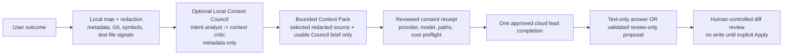

# Cenro Context Gateway MVP

## Product direction, with an honest current boundary

Cenro is not trying to make a small local model impersonate a frontier coding
model. It is the local context layer around one:

> Give a cloud lead engineer the repository evidence it needs, while keeping
> the data boundary, authority, cost, and file-write authority visible to the
> person who owns the code.

The goal is a better outcome per dollar, not artificial token compression. A
local map and a small local planning pass should prevent a strong cloud model
from rediscovering obvious repository facts or receiving a blind full-repo
dump.

This document separates the **implemented Gateway** from the product roadmap.
The implemented Gateway is a bounded, evidence-backed handoff with an optional
local planning Council and a review-only patch path. It is not an autonomous
patch-and-repair loop.

## What ships in the current Gateway

For one approved cloud run, Cenro currently:

1. Scans the user-selected workspace locally within explicit safety bounds.
2. Builds a repository map with language inventory, manifests, inferred entry
   points and test-file signals, Git metadata, and locally extracted symbols.
3. Runs an optional **Local Context Council** in sequence: `intent analyst ->
   context critic`. It receives only the user request and sanitized repository
   metadata; it never receives raw workspace source, diffs, hashes, or secrets.
4. Uses a strict, small Council report (acceptance criteria, risk flags, search
   terms, and selection rationale) as a fallible planning aid in the packed
   cloud prompt only when the Council is completed/degraded and made at least
   one local call. Unavailable or cancelled Councils keep a deterministic
   metadata-only fallback in the local receipt/UI and add no Council text to
   the cloud prompt.
5. Ranks a bounded set of relevant source files using request terms and local
   repository signals, then redacts recognized inline credentials.
6. Keeps the raw Context Pack in the Electron main process for at most ten
   minutes and shows a renderer-safe receipt instead of raw code.
7. Binds one provider/model, one prompt, the selected evidence, and a cost
   preflight into an owner-bound, single-use approval.
8. Makes one provider completion only after the user approves that exact
   receipt, then records sanitized usage/cost facts locally when available.
9. Treats a valid bounded cloud change object as a **review-only patch
   proposal** and opens it in the existing diff review. All other cloud output
   remains text-only.

The Gateway does **not** currently:

- expose callable local tools to the cloud lead during a completion;
- fetch a new source slice automatically after the initial handoff;
- fan out to several cloud or local agents;
- apply a proposed patch, write a file, run a command, run tests, browse the
  web, or claim that any verification passed; or
- include web research in the Gateway handoff.

The proposal path is deliberately inert. It can prepare a diff for review, but
only the user can choose the existing explicit Apply action. Verification items
are a checklist to consider, never a record that Cenro executed them.

## Repository awareness without a token dump

"Whole-repository awareness" is a local orientation layer, not a claim that
every byte of every repository is read or sent. The mapper uses safe limits
(including file count, depth, text-file size, and context size) and marks a
scan as truncated when a limit is reached. Dependency folders, generated
output, binary-looking files, secret-looking paths, and symlinks are excluded
before selected source content is packaged.

The current path is intentionally bounded:

The initial Context Pack contains a local repository dossier plus exact,
redacted selected source files. Today, selected files are supplied as bounded
whole-file slices (`line 1` through the locally read end of file). The cloud
lead can state that more evidence is needed in its response, but Cenro does
not automatically retrieve or transmit that evidence in the same run.

Any future additional cloud-bound source slice needs a new visible receipt and
approval. The Council does not bypass that boundary: it never sees source
content in the first place.

## Local Context Council contract

The Council is a local preflight, not a source-reading agent swarm. It has two
ordered roles and runs at most one local model request at a time:

| Stage | Input | Output | Safety boundary |
| --- | --- | --- | --- |
| Intent analyst | User request + sanitized repository metadata | Concise acceptance criteria, risks, search terms | No raw code, diffs, hashes, or secrets. |
| Context critic | Same metadata + validated prior report | A narrower rationale and risk check | No source access and no parallel model calls. |

The metadata can include safe path names, language counts, manifest/entrypoint
and test-file names, changed path names, and extracted symbol names from
selected files. It excludes content and is sanitized to a fixed shape before a
local model sees it.

Council output must match an exact JSON schema. Invalid, unavailable, timed-out,
or cancelled stages fall back to deterministic metadata-only output. The Council
report is untrusted planning context, not authority: it cannot invoke tools,
change selection rules, execute anything, or manufacture source code. Only a
completed/degraded Council with one or more local calls contributes a compact
validated summary to the cloud prompt after the user approves the boundary;
receipt-only fallbacks add no cloud tokens.

## Review-only cloud patch contract

The cloud lead can return either plain text or a strict JSON change proposal.
For a proposal to reach diff review, it must contain exactly:

- a concise `summary`;
- one to twelve workspace-relative `create` or `update` files, each with a
  complete replacement text and a reason; and
- one to twelve verification steps.

The combined replacement text is capped at 500 KB. Unsupported fields,
duplicate/protected/secret-looking paths, binary content, invalid actions, and
oversized or malformed output are rejected. A rejected proposal is preserved as
ordinary text rather than being converted into an unsafe file action.

Before review, Cenro resolves every proposed path inside the selected canonical
workspace, rejects symlink escapes, reads the current original text, and binds
the review object to that state. The resulting multi-file proposal opens in the
existing diff surface. It still writes nothing. The usual Apply flow must check
the reviewed file state and receive the user's explicit action.

`verification` is descriptive only: it lists tests or manual checks the user
may run. Cenro does not auto-run those commands, report them as passed, or use
them to trigger a hidden repair call.

## Roles: delivered components and planned support roles

"Multiple agents" describes specialized roles, not seven models resident in
memory. The Gateway currently delivers the first six rows below. Later critics
and repair loops remain planned, sequential extensions.

| Role | Current implementation | Cloud boundary |
| --- | --- | --- |
| Repository mapper | Deterministic workspace scan, Git snapshot, manifests, symbols, test-file inference | Never sends raw code by itself. |
| Context curator | Deterministic relevance ranking, redaction, provenance, bounded packing | Sends selected redacted evidence only after consent. |
| Intent analyst | Optional local Council stage, followed by deterministic fallback when needed | Metadata and user request only; never raw source. |
| Context critic | Optional sequential Council stage | Metadata and validated Council output only; never raw source. |
| Consent and cost gate | Main-process receipt binding, optional price-card preflight, sanitized ledger | Blocks the call until the receipt is approved. |
| Cloud lead | One completion through a user-configured provider | Returns text or a bounded review-only proposal. |
| Verifier/repair loop | Planned explicit test/diff evidence loop | Must never auto-apply or auto-run commands. |

On an 8-11 GB Windows machine, Cenro recommends at most one loaded local model
at a time. Repository indexing, symbol extraction, Git inspection, redaction,
provenance, consent, and cost calculation are deterministic local work and do
not require an LLM. `qwen3:1.7b` is the first optional Council model;
`qwen2.5-coder:3b` is optional for focused local review when enough memory is
available; `qwen3:4b` is intended for more capable machines. The default is a
sequential schedule, not a model swarm.

## Current Context Pack and redaction contract

Before a cloud call, the main process creates an ephemeral Context Pack. Its
renderer-safe analysis exposes only safe metadata. The raw selected source is
kept only in memory for the pack's short lifetime and is removed after a
completed or failed run.

For each selected source, the analysis records:

- normalized relative path;
- language, local symbol hints, relevance score, and locally derived reasons;
- character and token estimate;
- count of inline redactions; and
- a digest of the redacted selection used to protect the handoff.

For excluded inputs, Cenro records only safe category/count information, such
as `secret-looking`, `binary`, `symlink`, `too-large`, or `scan-limit`. It does
not put excluded content into the Context Pack receipt or durable Gateway
ledger.

The current redaction policy:

1. Excludes secret-looking path names before source content is read, including
   `.env*`, `.envrc`, key/certificate-like names, and credential directories.
2. Rejects symlinks and paths outside the canonical user-selected workspace.
3. Redacts known inline private-key blocks and common token/credential forms
   before hashing and packaging selected source text.
4. Treats repository content, Council output, and the cloud response as
   untrusted reference material, not instructions that can override Cenro's
   policy.
5. Sends only the redacted prompt, local dossier, selected source, and, when a
   usable local Council result exists, its compact brief. Receipt-only Council
   fallbacks are not sent. There is no hidden follow-up source upload.

Redaction is defense in depth, not a guarantee that every secret format will
be recognized. Users should still inspect the visible path/count receipt before
approving a cloud boundary.

## Consent is tied to one exact handoff

Cloud approval is not a global toggle. A run receipt is short-lived,
owner-bound, and single-use. It binds the user request, Context Pack identity,
provider, exact model, selected source metadata, output cap, configured price
card, and expiry. Changes to the prompt, selected pack, provider/model, or
pricing require a new receipt.

The consent surface shows the provider and model, selected relative paths,
character/token estimates, redaction count, and a maximum-cost preflight when
a complete price card exists. If the user cancels instead of approving,
**no Gateway provider request is made**. The current Gateway requires approval
to include the reviewed workspace context; it does not implement a prompt-only
Gateway fallback in the UI.

Web research is outside the current Gateway run. Any future web route must
receive its own exact consent boundary rather than inheriting a workspace
approval.

## Cost ledger: what Cenro can honestly say

Cenro may show a local token estimate before a request. It labels dollar
figures as estimates and emits them only from a user-supplied price card for
the selected provider. A configured budget rejects an approved run when that
maximum estimate exceeds the budget.

After a completion, Cenro stores only safe run facts: provider/model, status,
character counts, estimated input, output cap, provider-reported usage when
available, and a calculated actual cost only when both usable usage and pricing
exist. It does not store prompts, source code, response content, API keys, raw
provider errors, or source paths in the durable Gateway ledger.

The current Gateway does not calculate or display a "tokens saved" or
"avoided spend" figure because it does not have a comparable measured baseline.
That comparison belongs in a future benchmark feature, not in marketing copy.

Reasoning output is not double-counted when a provider reports it as a subset
of output tokens. If pricing or usage is absent, Cenro says `tokens only`,
`usage unavailable`, or `usage unpriced` rather than inventing a dollar value.

## What comes next

The initial handoff, metadata-only Council, and review-only proposal are the
first trustworthy layers. The next product increments should remain explicit
and reviewable:

1. **Bounded follow-up evidence tools:** a cloud lead can request a named local
   slice; Cenro creates a new receipt before any new source leaves the device.
2. **User-triggered verification evidence:** test and typecheck output becomes
   a bounded local artifact that can be reviewed before a repair call.
3. **More sequential local critics:** optional architecture and repair critics
   that reuse one small local model on entry-level Windows hardware.
4. **Measured benchmarks:** comparable task runs and price snapshots before
   making a savings claim.

This keeps Cenro's differentiation intact: the local machine supplies the
right context, challenges the framing without exposing source to local helpers,
and enforces the boundary; the frontier model spends its budget on hard
reasoning; the user keeps the final write and execution authority.
